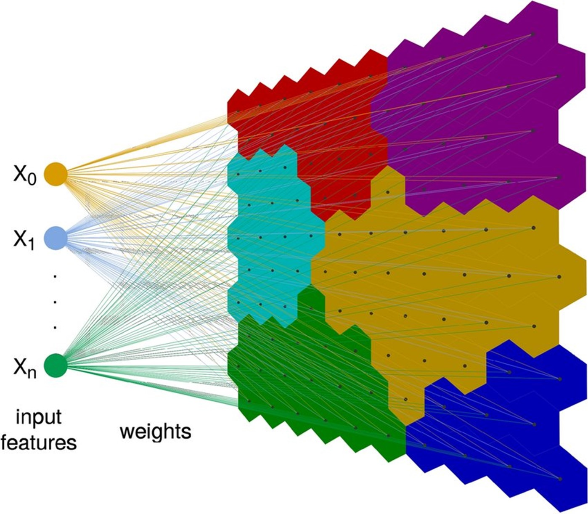
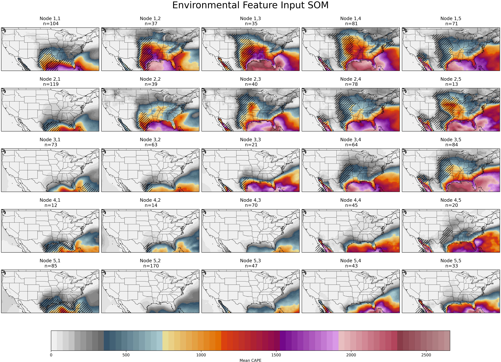
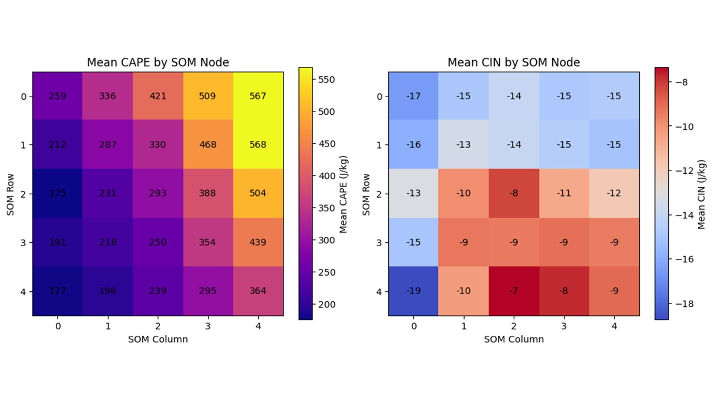
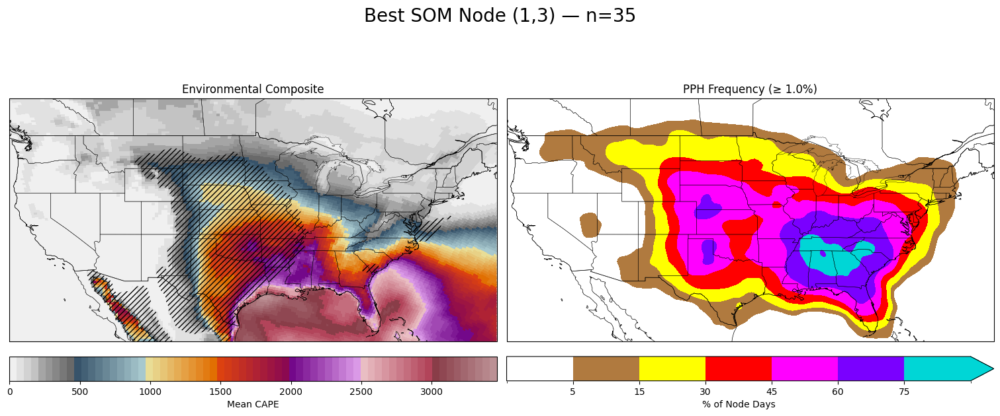
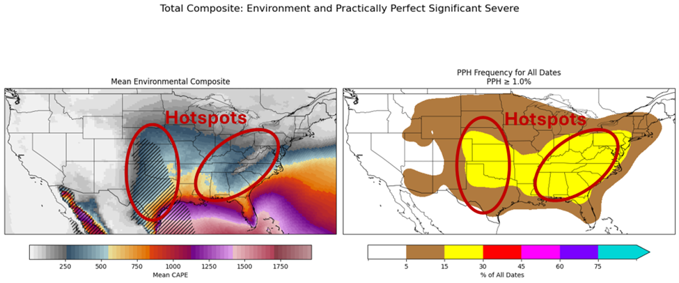

  
# **Identification-of-Significant-Severe-Weather-Regimes-using-Self-Organizing-Maps** #
*KELVIN T. HAWTHORNE, a LEXI GUTZWILER a*

*a Northern Illinois University, Department of Earth, Atmosphere, and Environment*

 

*Completed in partial completion of the course requirements for EAE 485/585, Data Science for the Geosciences*

*Professor: Dr. Alex M. Haberlie*

**ABSTRACT** Significant severe weather can occur in a wide range of atmospheric environments, making it difficult to identify consistent signals using traditional methods. This study uses a self-organizing map (SOM) to classify environments associated with significant severe weather in the eastern United States. Environmental variables from the CONUS404 dataset, including 500 hPa heights, 2 m dewpoint, and 700–500 hPa lapse rates, are combined with practically perfect hindcast significant severe fields to isolate relevant conditions. A 5 by 5 SOM is then used to cluster these environments into representative patterns. 

The results are expected to reveal a limited number of physically meaningful regimes that capture different combinations of synoptic forcing, moisture, and instability. These findings provide a structured way to interpret severe weather environments and highlight the multiple pathways through which significant severe convection can occur. 

**SIGNIFICANCE STATEMENT**
Severe weather that produces large hail, damaging winds, or tornadoes can develop under many different atmospheric conditions, which makes it difficult to identify clear patterns using traditional approaches. This study uses a machine learning technique called a self-organizing map to better understand the types of environments that support the most impactful severe weather across the eastern United States. By combining high-resolution weather data with a dataset that highlights where significant severe storms occurred, the analysis groups similar atmospheric setups together.
The results are expected to show that, while severe weather can happen in many situations, there are a limited number of common patterns that repeatedly support these high-impact events. Identifying these patterns provides a clearer and more organized way to understand how severe storms develop, and it highlights that there are multiple 

## **I. Introduction and Geoscience Problem** ##

  Forecasting significant severe weather is still one of the more challenging problems in meteorology because the environments that produce events like strong tornadoes, large hail, and damaging winds can vary a lot from case to case. Even when the atmosphere looks favorable, severe weather does not always occur, which makes it difficult to identify consistent signals. Because of this, forecasters often rely on the ingredients-based methodology, which focuses on whether key environmental ingredients, such as moisture, instability, lift, and vertical wind shear, are present and overlapping (Doswell et al. 1996). This approach is useful because it shifts the focus away from single parameters and instead emphasizes how different processes work together to support severe convection. 

  Even with this framework, there are still challenges in understanding how these ingredients combine across different events. Previous work has shown that environments supporting severe weather can look similar while producing very different outcomes, highlighting the importance of both synoptic and mesoscale processes (Johns and Doswell 1992). In addition, forecasting rare, high-impact events is inherently difficult due to limitations in predictability and the influence of smaller-scale variability (Hitchens et al. 2013). This means that simply identifying favorable environments is not always enough, and there is a need for methods that can better organize and interpret the range of conditions associated with significant severe weather. 

  To help address these challenges, this study uses the practically perfect hindcast (PPH) dataset as a verification tool. Unlike raw storm reports, which can be noisy and unevenly distributed, PPH fields apply spatial smoothing to produce a continuous representation of severe weather occurrence (Gensini et al. 2020). This makes it easier to compare environmental conditions with where severe weather actually occurred, especially when working with large datasets. Practically perfect hindcasts are particularly useful for studying significant severe events because they reduce reporting biases and provide a more consistent spatial signal. 

  In addition to verification, this study uses environmental data from the CONUS404 dataset to represent atmospheric conditions. Variables were selected based on their known importance in severe weather environments. Midlevel height patterns, such as 500-mb heights, help describe the large-scale synoptic setup and are often associated with troughs and forcing mechanisms that support severe weather (Brooks 2019). Low-level moisture, which can be represented with 2-m dewpoint, is critical for instability, updraft sustenance, and is commonly linked to more favorable severe environments (Gensini and Ashley 2011). The 700-500-mb lapse rate provides information about midlevel instability and the presence of elevated mixed layers, which can lead to more explosive convective initiation, more robust updraft formation, and subsequently, more hazardous peril production (Banakos and Ekster 2010; Andrews et al. 2024; Bechis et al. 2025). Together, these variables capture key aspects of the environment that influence the development of significant severe storms. 

  Given the complexity of these environments, pattern recognition techniques provide a useful way to organize the data and identify recurring structures in the atmosphere. These approaches allow for a more holistic view of how environmental conditions vary across events, rather than focus on individual variables in isolation. This is especially important for severe weather environments, which often do not follow a single, well defined pattern. 

  The goal of this study is to use machine learning techniques to identify and classify environmental regimes associated with significant severe weather (hail ≥ 2”, wind ≥ 60 MPH, and tornadoes EF2+) in the eastern CONUS. By examining how atmospheric conditions group together across many events, this study aims to identify recurring patterns that are conducive to significant severe weather and to better understand how these environments vary from case to case. This approach provides a structured way to analyze complex atmospheric conditions and offers insight into the range of environments that can support high-impact severe weather. 

  ## **II. Data and Methods** ##

*a. Datasets*

To identify environments indicative of significant severe weather, North American Regional Reanalysis (NARR) is used to extract environmental parameter. NARR is a 32-kilometer reanalysis dataset based on the discontinued Eta model. The temporal period stretches from 1972 to March of 2026 and contains daily and monthly mean data. For the purposes of this project, daily mean Convective Availavble Potential Energy (CAPE) and Convective Inhibition (CIN) are extracted as yearly netcdf files and mergered into a broad dataset, suitable for model preprocessing and training. 

The validation dataset for this project is the Practically Perfect Hindcast (PPH), which provides gridded representations of observed severe weather reports by applying spatial smoothing to Storm Prediction Center (SPC) severe weather reports. This approach reduces the impact of reporting biases, spatial clustering, and population effects while retaining the underlying signal of severe weather occurrence (Sobash et al. 2011; Gensini et al. 2020). The PPH dataset has been widely used in severe weather climatology and machine learning applications, as it provides a continuous, grid-based representation of severe weather likelihood that is more directly comparable to environmental datasets than raw point observations.

*b. Environmental identifiers/proxies*

Two environmental proxies are used to help cluster and later identify significant severe weather regimes. The first variable is CAPE which is a measure of atmospheric instability. Since instability is required for convective storm formation, this variable will be essential in identifying days where significant severe weather occurs. Prior work has found that the higher the instability the higher the likelihood for convective storm formation. CAPE is calculated as daily mean for the entire three-year period that we evaluate in our model. The shortfall of this method, instead of a method like daily maximum, is that we are smoothing what may be the most significant value of atmospheric instability any given day. Still, daily mean CAPE will give us a clue as to the type of regimes that exist.

The second environmental proxy is CIN. Unlike CAPE, which quantifies atmospheric instability, CIN measures the lack of atmospheric instability. CIN is the resistance of the atmosphere to a parcel rising because the parcel is cooler than the surrounding environment. This causes the parcel to either sink to its original position or remain stagnant and not rise at all. Strong CIN indicates an environment not conducive to thunderstorm formation, but this is highly dependent on several external factors such as convective battering and synoptic scale forcing for ascent. Like CAPE, CIN is calculated in the simulations used in this project as a daily mean rather than the preferable daily minimum. 

While other environmental parameters are certainly important to produce significant severe weather, limited computational expense and time require a more simple, double-variate approach to be used. If computational resources and time had permitted, other variables like 700-500hPa lapse rate (for EML presence) and/or vertical wind shear could have been evaluated as well. 

*c. Self-Organizing Maps (SOMs)* 

A self-organizing map (SOM) is used in this study to identify and group similar severe weather environments into a set of representative regimes (Kohonen, 1982). SOMs are an unsupervised machine learning technique that reduces high-dimensional data into a lower-dimensional grid while preserving the underlying structure of the dataset (Fig. 1; Kohonen, 1982). In this application, environmental variables are used as inputs, allowing the SOM to cluster similar atmospheric setups without imposing any predefined categories.

  
   
  <em>Fig. 1 Input features are seleced and fed into the self-organizing map that then clusters each feature into “nodes” that represent a mean of all cases in that node. Figure from Kohonen, 1982. The same process is applied to this project where atmospheric variables are input features, and they are organized by like case</em>

Each node in the SOM represents a characteristic environment, with nearby nodes corresponding to similar patterns and more distant nodes representing increasingly different regimes. This structure makes SOMs particularly useful for meteorological applications, as they provide a physically interpretable way to organize complex environmental variability. Rather than identifying a single “type” of severe weather environment, the SOM highlights a spectrum of regimes that capture different combinations of moisture, forcing, and stability.
By applying a SOM to the CONUS404-derived environmental fields, this study aims to identify recurring patterns associated with significant severe weather and provide a structured framework for interpreting how these environments vary across space and time.

*d.	Model Configuration*

Each SOM is tuned with a set of parameters that control how the model learns and clusters the feature input data. For this project, our parameters were selected arbitrarily through an iterative process, each time evaluating the visual practicality of the SOM output. At the concluding iteration (used in this study) we select a learning rate of 1, a sigma of 2, and 4000 n_iterations. The SOM grid is 5x5, which will result in 25 unique nodes. 
Preprocessing is done using the sklearn built in “StandardScalar” package which flattens data and converts it to z-score. Once the data is converted to z-score, the data is fed into the som training, which is coded using the sklearn “MiniSom” package. The output is then plotted by reconverting the data back to unstandardized values and plotted as a 5x5 group of subplots containing mean environmental inputs, each containing n number of dates from throughout the period. 
Once the environmental SOM nodes are plotted, we then plot the mean practically perfect nodes by extracting the dates from the environmental nodes and applying the same dates from the practically perfect dataset to the corresponding nodes. The resultant plot is a similar 5x5 group of subplots with mean practically perfect probabilities. These can then be compared against the environmental SOM nodes, and subsequent analysis can be conducted. 

  ## **III. Results** ##

The resulting environmental 5x5 SOM output shows ascending volatility in CAPE and CIN magnitude from the bottom row to the top row (Fig 2). Since we do not mask the oceans, high values of CAPE over warm and humid water surface results in a SOM where mean CAPE value increases from the bottom leftmost node to the top rightmost node (Fig 3). CIN has a more heterogenous distribution throughout the SOM, with the highest mean CIN value residing in the top left corner, generally increasing towards the bottom rightmost corner (Fig 3). 

  
   
  <em>Fig. 2</em>

  
   
  <em>Fig. 3</em>

The practically perfect SOM matches well to the environmental SOM in that the lowest occurrence of significant severe weather occurs in the bottom row of nodes while the highest occurrence of significant severe weather occurs in the top row. The best node for significant severe weather occurs at node 1,3 and this matches the most significant severe practically perfect probability (Fig 4). Node 1,3 shows a bifurcated maximum in significant severe practically perfect probabilities with the first being over the central and southern Great Plains while the second extends from the Deep South to the Ohio Valley. The environmental node from 1,3 shows high CAPE with >-50 J/kg of CIN over the Deep South and Ohio Valley sector while the Great Plains sectors show high CAPE and <-50 J/kg of CIN. Regardless, both regions produced significant severe, indicating that the model is picking up on two different types of significant severe weather setups. The first type of set-up, which aligns with the Central Great Plains, is likely indicative of supercellular events where the largest contribution to significant severe reports is hail and tornadoes. The second type of set-up, which is in the Deep South and Ohio Valley, is likely showing more QLCS, MCS, and derecho type setups where much of the contribution is likely from significant tornadoes and wind. 

  
   
  <em>Fig. 4</em>

To further investigate the bifurcated regions and the inference that there are two different “types” of outbreaks, a mean is taken from every environmental node and every practically perfect node (Fig 5). This is essentially serving as a “climatology” for the entire period. This climatology also demonstrates the two primary hotspots, and the eastern hotspot shows higher CAPE with weaker CIN while the western hotspot shows higer CAPE and stronger CIN. While both regimes produce nearly equal to significant severe weather, the methods from which they produce these significant severe perils are different. As mentioned before, the Plains hotspot likely shows supercell associated events while the Deep South and Ohio Valley hotspot likely shows QLCS/MCS associated events. Future work should physically run the total significant severe probabilities for each individual peril to confirm this hypothesis.

  
   
  <em>Fig. 5</em>

